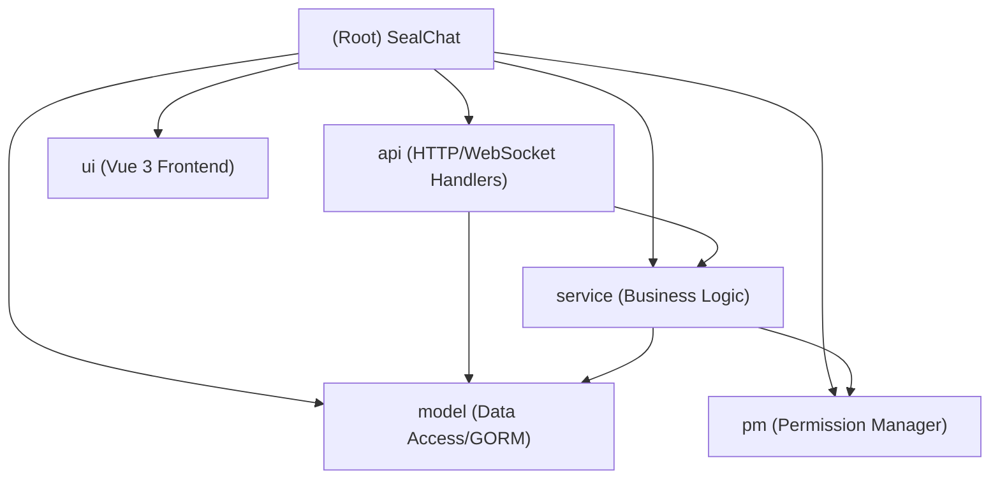

# SealChat Project Guide

## Project Vision
SealChat is a self-hosted, high-performance chat platform designed for role-playing communities. It features rich text editing, dice rolling, world/channel management, and multimedia support (audio/gallery). It is built as a single-binary application with a Go backend and an embedded Vue.js frontend.

## Architecture Overview
- **Backend**: Go (Golang) 1.24+ using Fiber web framework.
- **Frontend**: Vue 3 + Vite + TypeScript + Naive UI.
- **Database**: GORM (supports SQLite, MySQL, PostgreSQL).
- **Communication**: REST API + WebSocket (Fiber).
- **Deployment**: Single binary with embedded static assets.

## Module Structure



## Module Index

| Module | Path | Responsibility | Key Tech |
| :--- | :--- | :--- | :--- |
| **Frontend** | [`ui/`](./ui/AGENTS.md) | Web Client (SPA) | Vue 3, Vite, Pinia, Naive UI |
| **API** | [`api/`](./api/AGENTS.md) | HTTP Routes & WebSocket | Go Fiber |
| **Service** | [`service/`](./service/AGENTS.md) | Business Logic & Workers | Go, FFmpeg |
| **Model** | [`model/`](./model/AGENTS.md) | Database Schemas | GORM, SQLite/MySQL/PG |
| **Permissions** | `pm/` | RBAC & Permission Logic | Custom |

## Development & Running

### Prerequisites
- Go 1.24+
- Node.js 18+ & npm
- GCC (for CGO, SQLite)

### Quick Start
```bash
# 1. Build Frontend
cd ui
npm install
npm run build
cd ..

# 2. Run Backend (Dev)
go run main.go
# OR with watcher
air
```

### Build Production
```bash
# Build frontend first, then:
go build -tags=jsoniter .
```

## Testing Strategy
- **Backend**: Go standard testing. `go test ./...`
- **Frontend**: `npm run type-check` (Vue TSC).

## Coding Conventions
- **Go**: Follow standard Go idioms. Error handling is explicit. Use `utils.AppConfig` for configuration.
- **Vue**: Composition API (`<script setup lang="ts">`). Use Naive UI components.
- **API**: Routes defined in `api/api_bind.go`. Return JSON.

## AI Guidelines
- **No Mocking**: Read actual files before assuming structure.
- **Pathing**: Use absolute paths for file operations.
- **Safety**: Do not modify `go.mod` or `package.json` unless explicitly requested.

## Changelog
- **2026-01-13**: Generated initial AGENTS.md documentation.
